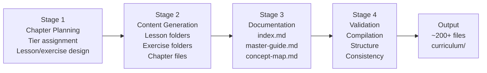
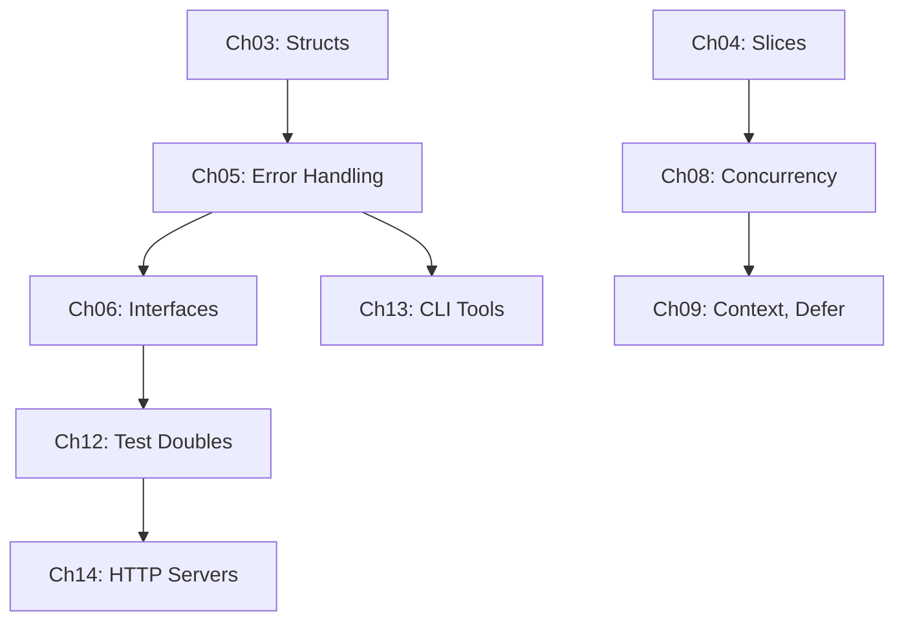
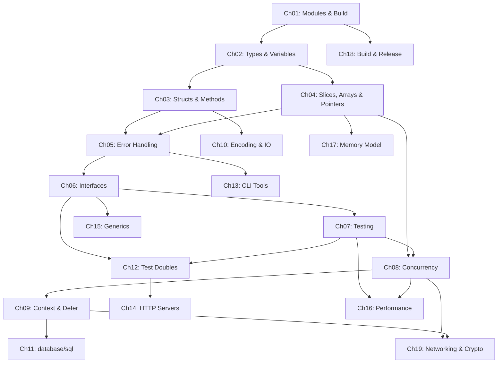

# Design Document: Go Learning Curriculum

## Overview

This design describes a content production pipeline that generates an interactive, runnable Go learning course organized into 3 tiers and 19 chapters. The output is approximately 200+ files under a `curriculum/` directory with tier subdirectories (`tier1-core/`, `tier2-practical/`, `tier3-expert/`), chapter folders, lesson subfolders, exercise subfolders, and top-level documentation.

The generator is not a running application — it is a pipeline executed by an AI agent that creates:
- Lesson folders: `lesson.md` + `main.go` + `go.mod` (self-contained, `go run .` works)
- Exercise folders: `instructions.md` + `starter.go` (compiles but incomplete) + `solution.go` (compiles and runs)
- Chapter files: `README.md`, `quiz.md`, `cheat-sheet.md`, `real-project.md`
- Documentation: `index.md`, `docs/master-guide.md`, `docs/concept-map.md`

All `.go` files compile and run with Go 1.24+. The only third-party libraries are Cobra (CLI) and `pgregory.net/rapid` (PBT).

### Key Design Decisions

1. **Interactive-first**: Every lesson has runnable `.go` files. `go run .` works from every lesson directory. No concept without executable code.
2. **Self-contained lesson folders**: Each lesson has its own `go.mod`, making it independently runnable without project-wide setup.
3. **Starter/solution exercise model**: `starter.go` compiles but is incomplete (TODO comments). `solution.go` compiles and runs correctly. Learners fill in the gaps.
4. **Tier directory organization**: Three tier directories provide clear visual progression, replacing a flat directory approach.
5. **Concept reinforcement**: Later chapters deliberately reuse types, patterns, and techniques from earlier chapters.
6. **Go 1.24+ target**: All code uses current Go features (method-aware routing, etc.).
7. **Two third-party libraries only**: Cobra and rapid. Everything else uses the Go standard library.
8. **Consistent real-project reference**: The "vocabulary generator" serves as the real-project example across all 19 chapters.

## Architecture

The pipeline has five stages executed sequentially:



### Stage 1: Chapter Planning

Map topics from `go-topic-ranking.md` to 19 chapters across 3 tiers:

| Tier | Directory | Chapters | Priority | Description |
|------|-----------|----------|----------|-------------|
| Tier 1 | `tier1-core/` | Ch 01–08 | HIGH | Core Go programming fundamentals |
| Tier 2 | `tier2-practical/` | Ch 09–15 | MEDIUM | Practical backend development |
| Tier 3 | `tier3-expert/` | Ch 16–19 | LOW | Specialized/advanced topics |

### Stage 2: Content Generation

For each chapter (in tier order: Tier 1 → Tier 2 → Tier 3), generate:
1. Lesson subfolders (lesson.md + .go files + go.mod)
2. Exercise subfolders (instructions.md + starter.go + solution.go + go.mod)
3. Chapter-level files (README.md, quiz.md, cheat-sheet.md, real-project.md)

### Stage 3: Documentation Generation

After all chapters exist:
1. `curriculum/index.md` — all 19 chapters grouped by tier
2. `curriculum/docs/master-guide.md` — curriculum overview
3. `curriculum/docs/concept-map.md` — cross-chapter concept links

### Stage 4: Validation

- Compilation: `go build ./...` from every lesson and exercise directory
- Run: lesson `main.go` and `solution.go` produce output
- Structure: correct files in correct locations
- Consistency: cross-chapter references, concept reinforcement

## Output Directory Structure

```
curriculum/
├── index.md
├── docs/
│   ├── master-guide.md
│   └── concept-map.md
├── tier1-core/
│   ├── ch01-modules-build/
│   │   ├── README.md
│   │   ├── quiz.md
│   │   ├── cheat-sheet.md
│   │   ├── real-project.md
│   │   ├── lesson1-go-mod/
│   │   │   ├── lesson.md
│   │   │   ├── main.go
│   │   │   └── go.mod
│   │   ├── lesson2-go-sum/
│   │   │   ├── lesson.md
│   │   │   ├── main.go
│   │   │   └── go.mod
│   │   ├── ...                          # 6–10 lesson subfolders total
│   │   └── exercises/
│   │       ├── exercise1-init-module/
│   │       │   ├── instructions.md
│   │       │   ├── starter.go
│   │       │   ├── solution.go
│   │       │   └── go.mod
│   │       ├── exercise2-add-dependency/
│   │       │   ├── instructions.md
│   │       │   ├── starter.go
│   │       │   ├── solution.go
│   │       │   └── go.mod
│   │       └── ...                      # 3–5 exercise subfolders total
│   ├── ch02-types-variables/
│   │   ├── README.md
│   │   ├── quiz.md
│   │   ├── cheat-sheet.md
│   │   ├── real-project.md
│   │   ├── lesson1-basic-types/
│   │   ├── lesson2-declarations/
│   │   ├── ...
│   │   └── exercises/
│   │       ├── exercise1-zero-values/
│   │       └── ...
│   ├── ch03-structs-methods/
│   ├── ch04-slices-arrays-pointers/
│   ├── ch05-error-handling/
│   ├── ch06-interfaces-abstraction/
│   ├── ch07-testing/
│   └── ch08-concurrency/
├── tier2-practical/
│   ├── ch09-context-defer/
│   ├── ch10-encoding-io/
│   ├── ch11-database-sql/
│   ├── ch12-test-doubles-service/
│   ├── ch13-cli-tools/
│   ├── ch14-http-servers/
│   └── ch15-generics/
└── tier3-expert/
    ├── ch16-performance/
    ├── ch17-memory-model/
    ├── ch18-build-release/
    └── ch19-networking-crypto/
```

### Naming Conventions

| Element | Pattern | Example |
|---------|---------|---------|
| Tier directory | `tier{N}-{slug}/` | `tier1-core/` |
| Chapter folder | `ch{NN}-{slug}/` | `ch01-modules-build/` |
| Lesson subfolder | `lesson{N}-{slug}/` | `lesson1-go-mod/` |
| Exercise subfolder | `exercise{N}-{slug}/` | `exercise1-init-module/` |
| Lesson explanation | `lesson.md` | Always `lesson.md` |
| Lesson code | `main.go` | Primary runnable file |
| Lesson module | `go.mod` | Self-contained module |
| Exercise instructions | `instructions.md` | Always `instructions.md` |
| Exercise starter | `starter.go` | Compiles but incomplete |
| Exercise solution | `solution.go` | Complete reference |

### Complete Chapter List

| # | Folder Name | Topic | Tier | Lessons | Exercises |
|---|-------------|-------|------|---------|-----------|
| 01 | `ch01-modules-build` | Modules, Build & Project Structure | 1 | 7 | 3 |
| 02 | `ch02-types-variables` | Types, Variables & Zero Values | 1 | 6 | 4 |
| 03 | `ch03-structs-methods` | Structs, Methods & Receivers | 1 | 6 | 4 |
| 04 | `ch04-slices-arrays-pointers` | Slices, Arrays & Pointers | 1 | 6 | 4 |
| 05 | `ch05-error-handling` | Error Handling | 1 | 6 | 4 |
| 06 | `ch06-interfaces-abstraction` | Interfaces & Abstraction | 1 | 6 | 3 |
| 07 | `ch07-testing` | Testing: Table-Driven & Property-Based | 1 | 7 | 4 |
| 08 | `ch08-concurrency` | Concurrency: Goroutines, Channels & Patterns | 1 | 7 | 4 |
| 09 | `ch09-context-defer` | Context, Defer & Resource Management | 2 | 6 | 3 |
| 10 | `ch10-encoding-io` | Encoding: JSON, YAML & IO Patterns | 2 | 7 | 4 |
| 11 | `ch11-database-sql` | database/sql & Data Persistence | 2 | 6 | 3 |
| 12 | `ch12-test-doubles-service` | Test Doubles & Service Architecture | 2 | 6 | 3 |
| 13 | `ch13-cli-tools` | CLI Tools: Cobra, slog & Build Injection | 2 | 7 | 4 |
| 14 | `ch14-http-servers` | HTTP Servers, Middleware & Templates | 2 | 8 | 4 |
| 15 | `ch15-generics` | Generics: Type Parameters & Constraints | 2 | 6 | 3 |
| 16 | `ch16-performance` | Performance: Benchmarks, Fuzzing & Profiling | 3 | 6 | 3 |
| 17 | `ch17-memory-model` | Memory Model & Escape Analysis | 3 | 6 | 3 |
| 18 | `ch18-build-release` | Advanced Build, Release & Workspaces | 3 | 6 | 3 |
| 19 | `ch19-networking-crypto` | Networking, Crypto & Protocol Design | 3 | 6 | 3 |


## Lesson Folder Template

Every lesson is a self-contained directory. `go run .` works from the lesson directory.

### lesson.md Format

```markdown
# Lesson N: [Title]

## Concept

[Concise explanation of the concept — 2-4 paragraphs max. Focus on what it is, why it matters, and how Go handles it.]

## Analogy

[Exactly one real-world analogy that maps the technical concept to an everyday idea. E.g., "Think of a Go module like a shipping container for your code..."]

## What the Code Demonstrates

[1-2 sentences describing what the accompanying main.go does and what output to expect when you run it.]

## Key Takeaways

- [Bullet point 1]
- [Bullet point 2]
- [Bullet point 3]
```

### main.go Format

```go
// Lesson N: [Title]
// Demonstrates: [one-line description of what this code shows]
//
// Run: go run .
package main

import "fmt"

func main() {
    // Code that demonstrates exactly the concept from lesson.md
    // Produces visible output via fmt.Println, log, or similar
    fmt.Println("...")
}
```

Rules for main.go:
- Must be in `package main` with a `func main()`
- Must produce visible output (fmt.Println, log, or other observable behavior)
- Must demonstrate exactly the concept described in lesson.md — no unrelated code
- Must compile and run with `go run .` from the lesson directory
- Must target Go 1.24+ standard library
- Comment at the top identifies the lesson and what it demonstrates

### go.mod Format

```
module lesson{N}-{slug}

go 1.24
```

Rules for go.mod:
- Module name matches the lesson folder name
- Go version is 1.24
- Only add `require` directives if the lesson uses Cobra or rapid
- No other third-party dependencies

### Multi-File Lessons

Some lessons require multiple `.go` files to demonstrate the concept:

| Concept | Extra Files | Reason |
|---------|-------------|--------|
| `internal/` pattern (Ch01) | `internal/helper/helper.go` | Demonstrates compiler-enforced privacy |
| Package organization (Ch01) | Multiple package files | Shows multi-package project |
| Struct embedding (Ch03) | Separate type files | Shows composition across files |
| Interface satisfaction (Ch06) | Separate interface + impl files | Shows implicit satisfaction |
| Test files (Ch07) | `main_test.go` | Demonstrates test file conventions |
| Middleware (Ch14) | `middleware.go` + `main.go` | Shows handler wrapping pattern |

For multi-file lessons:
- All `.go` files must be in the same directory (or subdirectories as needed)
- `go run .` must still work from the lesson directory
- The `go.mod` covers all files in the lesson directory

## Exercise Folder Template

Every exercise is a subfolder inside the chapter's `exercises/` directory.

### instructions.md Format

````markdown
# Exercise N: [Descriptive Title]

## Task

[Clear statement of what the learner should do. 2-3 sentences max.]

## Requirements

- [Specific requirement 1]
- [Specific requirement 2]
- [Specific requirement 3]

## Expected Behavior

When you complete the exercise and run `go run .`, you should see:

```
[Expected output]
```

## Hints

<details>
<summary>Hint 1</summary>

[First hint — nudge in the right direction]

</details>

<details>
<summary>Hint 2</summary>

[Second hint — more specific guidance]

</details>
````

### starter.go Format

```go
// Exercise N: [Title]
// Task: [one-line description]
//
// Instructions: Fill in the TODO sections below.
// Run: go run .
package main

import "fmt"

func main() {
    // TODO: [Description of what the learner should implement]
    // Hint: [Brief hint about the approach]

    fmt.Println("Exercise not yet complete — fill in the TODOs above")
}
```

Rules for starter.go:
- Must compile (`go build ./...` succeeds)
- Must be intentionally incomplete — TODO comments mark where the learner writes code
- Incompleteness is expressed through TODO comments and placeholder return values, not syntax errors
- May include helper functions or types that are already complete
- Must be in `package main` with a `func main()`

### solution.go Format

```go
// Exercise N: [Title] — SOLUTION
// This is the reference solution. Try to complete starter.go before looking!
//
// Run: go run solution.go
package main

import "fmt"

func main() {
    // Complete implementation that produces the expected output
    fmt.Println("...")
}
```

Rules for solution.go:
- Must compile and run correctly
- Must produce the expected output described in instructions.md
- Must be runnable independently: `go run solution.go` works
- Must demonstrate the concepts from the chapter's lessons

### Exercise go.mod

Every exercise directory includes its own `go.mod` for self-containment:

```
module exercise{N}-{slug}

go 1.24
```

Only add `require` directives for Cobra or rapid if the exercise uses them.

## Chapter Folder Template

Every chapter folder contains these files at the chapter level, plus lesson and exercise subfolders.

### README.md Format

```markdown
# Chapter NN: [Title]

**Learning Goal:** [One sentence describing what the learner will be able to do after this chapter.]

**Prerequisites:** [List of prior chapters the learner should complete first, or "None" for Chapter 01.]

## Lessons

1. [Lesson 1: Title](lesson1-slug/) — [One-sentence summary]
2. [Lesson 2: Title](lesson2-slug/) — [One-sentence summary]
3. ...

## Exercises

1. [Exercise 1: Title](exercises/exercise1-slug/) — [One-sentence summary]
2. [Exercise 2: Title](exercises/exercise2-slug/) — [One-sentence summary]
3. ...

## Concepts Reinforced from Earlier Chapters

- **[Concept] (Chapter NN):** [How this chapter reuses or builds on the earlier concept]
- ...

[For Chapter 01, this section reads: "This is the first chapter — no prior concepts to reinforce."]
```

### quiz.md Format

```markdown
# Chapter NN Quiz: [Title]

Test your understanding of [topic].

---

**Question 1:** [Question text]

- a) [Option]
- b) [Option]
- c) [Option]
- d) [Option]

---

[Repeat for exactly 5 questions]

---

<details>
<summary>Answers</summary>

1. **b)** — [One-sentence explanation of why this is correct]
2. **a)** — [One-sentence explanation]
3. **d)** — [One-sentence explanation]
4. **c)** — [One-sentence explanation]
5. **a)** — [One-sentence explanation]

</details>
```

Rules for quiz.md:
- Exactly 5 questions
- Exactly 4 options per question, labeled a through d
- Answers in a collapsible `<details><summary>` section
- Each answer includes a one-sentence explanation
- All questions reference concepts from the same chapter's lessons

### cheat-sheet.md Format

```markdown
# Chapter NN Cheat Sheet: [Title]

| Pattern | Code |
|---------|------|
| [Pattern name from lesson 1] | `[Go code or shell command]` |
| [Pattern name from lesson 2] | `[Go code or shell command]` |
| ... | ... |
```

Rules for cheat-sheet.md:
- Two-column Markdown table with columns "Pattern" and "Code"
- At least one entry per lesson in the chapter (≥ lesson count rows)
- All code snippets must be syntactically valid Go or valid shell commands
- Patterns should be scannable — learner finds the answer in < 30 seconds

### real-project.md Format

```markdown
# Chapter NN Real-Project Connection: [Title]

## How These Concepts Apply: Vocabulary Generator

In a vocabulary generator CLI application, the concepts from this chapter appear in these ways:

### [Concept 1 from this chapter]

[2-3 sentences explaining how this concept is used in the vocabulary generator, with concrete file paths, function names, or architectural patterns.]

### [Concept 2 from this chapter]

[2-3 sentences with concrete references.]

### [Concept 3 from this chapter]

[2-3 sentences with concrete references.]
```

Rules for real-project.md:
- Must reference "vocabulary generator" as the consistent example project
- Must map at least 3 concepts from the chapter to the project
- Must include concrete code structure references (file paths, function names, or architectural patterns)


## Documentation Template

### index.md Format

```markdown
# Go Learning Curriculum

**Prerequisites:** Basic programming experience in at least one language (e.g., Python, JavaScript).

## Tier Overview

### Tier 1: Core Go Programming (Chapters 01–08)
[Description of tier purpose and scope]

### Tier 2: Practical Go Backend Development (Chapters 09–15)
[Description of tier purpose and scope]

### Tier 3: Expert Topics (Chapters 16–19)
[Description of tier purpose and scope]

## Chapters

### Tier 1: Core Go Programming

| # | Chapter | Summary | Prerequisites |
|---|---------|---------|---------------|
| 01 | [Modules, Build & Project Structure](tier1-core/ch01-modules-build/) | [summary] | None |
| 02 | [Types, Variables & Zero Values](tier1-core/ch02-types-variables/) | [summary] | Ch01 |
| ... | ... | ... | ... |

### Tier 2: Practical Go Backend Development

| # | Chapter | Summary | Prerequisites |
|---|---------|---------|---------------|
| 09 | [Context, Defer & Resource Management](tier2-practical/ch09-context-defer/) | [summary] | Ch08 |
| ... | ... | ... | ... |

### Tier 3: Expert Topics

| # | Chapter | Summary | Prerequisites |
|---|---------|---------|---------------|
| 16 | [Performance: Benchmarks, Fuzzing & Profiling](tier3-expert/ch16-performance/) | [summary] | Ch07, Ch08 |
| ... | ... | ... | ... |

*Tier 3 chapters can be consumed independently of each other.*
```

### master-guide.md Format

```markdown
# Master Guide: Go Learning Curriculum

## Curriculum Overview
[Complete overview of the 19-chapter, 3-tier curriculum]

## Learning Path Recommendations
[Suggested paths for different learner profiles]

## Time Estimates
[Estimated time per tier and per chapter]

## Tier Descriptions
[Detailed description of each tier's purpose, scope, and target audience]
```

### concept-map.md Format

```markdown
# Concept Map: Cross-Chapter Connections

## How Concepts Flow Across Chapters

[Mermaid diagram or table showing concept dependencies]

## Detailed Connections

| Source Chapter | Target Chapter | Concept | How It's Used |
|----------------|---------------|---------|---------------|
| Ch03 (Structs) | Ch05 (Errors) | Struct definitions | Custom error types are structs |
| ... | ... | ... | ... |
```

## Concept Reinforcement Map

Later chapters deliberately reuse concepts from earlier chapters. This map defines the required cross-references (Requirement 6):



### Detailed Reinforcement Requirements

| Target Chapter | Source Chapter | What's Reinforced | How It Appears in Code |
|----------------|---------------|-------------------|----------------------|
| Ch05 (Error Handling) | Ch03 (Structs) | Struct definitions | Exercise code defines custom error types as structs with fields from Ch03 patterns (e.g., `type ValidationError struct { Field string; Message string }`) |
| Ch06 (Interfaces) | Ch05 (Error Handling) | Error interface | Lessons motivate interfaces by showing that `error` is an interface; exercises implement the `error` interface on custom types |
| Ch08 (Concurrency) | Ch04 (Slices) | Slice operations | Exercise code processes slices concurrently (e.g., parallel map over a slice, fan-out workers processing slice elements) |
| Ch09 (Context, Defer) | Ch08 (Concurrency) | Goroutines, channels | Lessons show context cancellation propagating to goroutines; exercises use channels with context for timeout patterns |
| Ch12 (Test Doubles) | Ch06 (Interfaces) | Interface-based design | Lessons explain that test doubles work because Go interfaces are implicit; exercises create doubles by implementing interfaces from Ch06 |
| Ch13 (CLI Tools) | Ch05 (Error Handling) | Error wrapping, sentinel errors | Cobra `RunE` functions return wrapped errors; exercises use `errors.Is` for error checking in CLI commands |
| Ch14 (HTTP Servers) | Ch12 (Test Doubles) | Service layer pattern | HTTP handlers are thin wrappers calling service layer; exercises test handlers using service interface doubles |

### README Reinforcement Section Per Chapter

| Chapter | Reinforced Concepts |
|---------|-------------------|
| Ch01 | None (first chapter) |
| Ch02 | Ch01: Module structure (code lives in modules) |
| Ch03 | Ch02: Types and zero values (struct fields have zero values) |
| Ch04 | Ch02: Value types (slices are reference types vs value types) |
| Ch05 | Ch03: Structs (custom error types are structs) |
| Ch06 | Ch05: Error handling (error is an interface) |
| Ch07 | Ch02–Ch06: All prior concepts appear in test examples |
| Ch08 | Ch04: Slices (concurrent processing of collections) |
| Ch09 | Ch08: Concurrency (context cancellation for goroutines) |
| Ch10 | Ch03: Structs + tags (JSON/YAML marshaling uses struct tags) |
| Ch11 | Ch05: Error handling (database operations return errors), Ch09: Context (query context) |
| Ch12 | Ch06: Interfaces (test doubles implement interfaces) |
| Ch13 | Ch05: Error handling (Cobra RunE returns errors) |
| Ch14 | Ch12: Service layer (handlers call services), Ch06: Interfaces (handler dependencies) |
| Ch15 | Ch04: Slices (generic slice utilities), Ch06: Interfaces (constraints vs interfaces) |
| Ch16 | Ch07: Testing (benchmarks extend testing.B), Ch08: Concurrency (race detector) |
| Ch17 | Ch04: Pointers (stack vs heap for pointer escapes) |
| Ch18 | Ch01: Modules (workspaces extend module system) |
| Ch19 | Ch08: Concurrency (goroutines for server connections), Ch09: Context (connection timeouts) |


## Content Generation Workflow

The generation pipeline processes chapters in tier order, then documentation.

### Chapter Generation Pipeline

Each chapter goes through 8 steps in sequence:

| Step | Action | Output |
|------|--------|--------|
| 1 | Create chapter folder structure | Chapter dir, lesson dirs, exercises/ dir |
| 2 | Generate lesson subfolders (6–10) | lesson.md + main.go + go.mod per lesson |
| 3 | Generate exercise subfolders (3–5) | instructions.md + starter.go + solution.go + go.mod per exercise |
| 4 | Generate quiz.md | 5 questions, 4 options each, collapsible answers |
| 5 | Generate cheat-sheet.md | Pattern/Code table, ≥1 row per lesson |
| 6 | Generate real-project.md | Vocabulary generator connection, ≥3 concepts |
| 7 | Generate README.md | Title, goal, prereqs, lesson list, reinforced concepts |
| 8 | Validate chapter | Compilation, file presence, structural checks |

### Lesson Generation Steps

| Step | Action | Details |
|------|--------|---------|
| 1 | Write lesson.md | Concept explanation, one analogy, code description, key takeaways |
| 2 | Write main.go | Compiles, runs, produces visible output, demonstrates the concept |
| 3 | Write go.mod | Module name matches folder, go 1.24 |
| 4 | Add extra files | Only for multi-file lessons (internal/, packages, test files) |

### Exercise Generation Steps

| Step | Action | Details |
|------|--------|---------|
| 1 | Write instructions.md | Title, task, requirements, expected behavior, collapsible hints |
| 2 | Write solution.go first | Complete implementation, compiles and runs, produces expected output |
| 3 | Derive starter.go | Remove implementations from solution, add TODO comments, must still compile |
| 4 | Write go.mod | Self-contained module for the exercise |

### Generation Order

| Phase | Scope | Sequence |
|-------|-------|----------|
| Phase 1 | Tier 1 | Ch01, Ch02, Ch03, Ch04, Ch05, Ch06, Ch07, Ch08 |
| Phase 2 | Tier 2 | Ch09, Ch10, Ch11, Ch12, Ch13, Ch14, Ch15 |
| Phase 3 | Tier 3 | Ch16, Ch17, Ch18, Ch19 |
| Phase 4 | Documentation | index.md, master-guide.md, concept-map.md |
| Phase 5 | Validation | Compile all .go files, run solutions, structural checks, property tests |

### Cross-Chapter Prerequisite Map



### Prerequisite Table

| Chapter | Direct Prerequisites |
|---------|---------------------|
| Ch01 | None |
| Ch02 | Ch01 |
| Ch03 | Ch02 |
| Ch04 | Ch02 |
| Ch05 | Ch03, Ch04 |
| Ch06 | Ch05 |
| Ch07 | Ch06 |
| Ch08 | Ch04, Ch07 |
| Ch09 | Ch08 |
| Ch10 | Ch03 |
| Ch11 | Ch09 |
| Ch12 | Ch06, Ch07 |
| Ch13 | Ch05 |
| Ch14 | Ch12 |
| Ch15 | Ch06 |
| Ch16 | Ch07, Ch08 |
| Ch17 | Ch04 |
| Ch18 | Ch01 |
| Ch19 | Ch08, Ch09 |

Key ordering constraints:
- Ch01 is first (project setup before application concepts)
- Ch02 before Ch03 (types before structs)
- Ch04 before Ch08 (value semantics before concurrency)
- Ch05 before Ch06 (error interface motivates interfaces)
- Ch06 before Ch12 (interfaces enable test doubles)
- Ch07 before any Tier 2 chapter (testing skills required)
- Tier 3 chapters are independently consumable (no inter-Tier-3 dependencies)

## Validation Checklist

Validation runs after all content is generated. It covers four categories mapped to requirements.

### Compilation Validation

| Target | Command | Expected Result | Requirement |
|--------|---------|-----------------|-------------|
| Lesson main.go | `cd lesson{N}-{slug} && go build ./...` | Exit code 0 | Req 3.4, 4.1 |
| Exercise starter.go | `cd exercise{N}-{slug} && go build ./...` | Exit code 0 | Req 4.3, 5.3 |
| Exercise solution.go | `cd exercise{N}-{slug} && go run solution.go` | Exit code 0 + output | Req 4.2, 5.4 |

### Run Validation

| Target | Command | Validation | Requirement |
|--------|---------|------------|-------------|
| Lesson main.go | `go run .` from lesson dir | stdout is non-empty | Req 3.5 |
| Exercise solution.go | `go run solution.go` from exercise dir | stdout is non-empty | Req 4.2 |

Starter files are NOT expected to produce meaningful output.

### Structural Validation

| Check | Rule | Requirement |
|-------|------|-------------|
| Tier directories exist | `tier1-core/`, `tier2-practical/`, `tier3-expert/` | Req 1.2 |
| Chapter distribution | 8 in tier1, 7 in tier2, 4 in tier3 | Req 1.1 |
| Chapter folder exists | `tier{N}-{slug}/ch{NN}-{slug}/` | Req 2.1 |
| README.md exists | One per chapter | Req 2.1 |
| quiz.md exists | One per chapter | Req 2.5 |
| cheat-sheet.md exists | One per chapter | Req 2.6 |
| real-project.md exists | One per chapter | Req 2.7 |
| Lesson count | 6 ≤ lesson subfolders ≤ 10 | Req 2.3 |
| Exercise count | 3 ≤ exercise subfolders ≤ 5 | Req 2.4 |
| Lesson files | Each lesson has lesson.md, ≥1 .go file, go.mod | Req 3.1, 3.2 |
| Exercise files | Each exercise has instructions.md, starter.go, solution.go, go.mod | Req 5.1 |
| Documentation | index.md, docs/master-guide.md, docs/concept-map.md exist | Req 11.1–11.3 |

### Content Validation

| Check | Rule | Requirement |
|-------|------|-------------|
| Lesson analogy | lesson.md contains analogy section | Req 3.3 |
| Quiz question count | quiz.md has exactly 5 questions | Req 7.1 |
| Quiz option count | Each question has 4 options (a–d) | Req 7.1 |
| Quiz answers collapsible | `<details><summary>` wrapper present | Req 7.2 |
| Quiz answer explanations | Each answer has one-sentence explanation | Req 7.3 |
| Cheat sheet format | Two-column table (Pattern \| Code) | Req 8.1 |
| Cheat sheet coverage | Row count ≥ lesson count | Req 8.2 |
| Real-project reference | Contains "vocabulary generator" | Req 9.1 |
| Real-project mappings | ≥ 3 concept mappings | Req 9.2 |
| README prerequisites | Prerequisites listed (or "None") | Req 2.8 |
| README reinforced concepts | Lists prior concepts reinforced | Req 6.8 |
| Starter TODO comments | starter.go contains "TODO" | Req 5.3 |
| Third-party constraint | Only Cobra and rapid as dependencies | Req 4.6, 13.4 |
| Go version | go.mod specifies `go 1.24` | Req 4.5 |
| Index completeness | index.md lists all 19 chapters with links | Req 11.1 |
| Tier 3 independence | Tier 3 chapters note independent consumability | Req 1.8, 10.8 |
| Naming conventions | lesson{N}-{slug}/, exercise{N}-{slug}/ | Req 3.7, 5.6 |


## Data Models

### Source Structure (Input)

```
concept-learning-modules/
├── 01-modules-and-build.md          # Reference for Ch01
├── 02-errors-structs-and-testing.md # Reference for Ch03, Ch05, Ch07
├── 03-interfaces-context-and-sql.md # Reference for Ch06, Ch09, Ch11
├── 04-mocks-timeouts-and-service-layer.md  # Reference for Ch12
├── 05-cobra-slog-and-ldflags.md     # Reference for Ch13
├── 06-embed-templates-and-http.md   # Reference for Ch14
└── go-topic-ranking.md              # Tier assignment source
```

Source files are reference material — not all chapters have a direct source file. Content is adapted and reorganized for optimal learning progression.

### Output Structure (Curriculum)

```
Curriculum:
  index: IndexFile
  docs: DocsDirectory
  tiers: [3]Tier

Tier:
  number: int                    # 1, 2, or 3
  slug: string                   # "core", "practical", "expert"
  directory: string              # "tier1-core", "tier2-practical", "tier3-expert"
  chapters: []Chapter

DocsDirectory:
  master_guide: MasterGuideFile
  concept_map: ConceptMapFile

IndexFile:
  path: "curriculum/index.md"
  prerequisites_note: string
  tier_overview: []TierDescription
  chapter_entries: [19]ChapterEntry

ChapterEntry:
  number: int                    # 01–19
  title: string
  relative_link: string          # e.g., "tier1-core/ch01-modules-build/"
  summary: string
  prerequisites: []int
```

### Lesson Schema

```
Lesson:
  number: int                    # Sequential within chapter
  slug: string                   # e.g., "go-mod"
  folder_name: string            # e.g., "lesson1-go-mod"
  lesson_md: LessonMarkdown
  go_files: []GoFile             # At least 1 (main.go)
  go_mod: GoModFile
  is_multi_file: bool

LessonMarkdown:
  title: string
  concept_explanation: string    # 2-4 paragraphs
  analogy: string                # Exactly one real-world analogy
  code_description: string       # What main.go demonstrates
  key_takeaways: []string

GoFile:
  filename: string               # "main.go" or other
  package_name: string           # "main" for runnable files
  imports: []string
  produces_output: bool          # Must be true for main.go
  compiles: bool                 # Must be true for all

GoModFile:
  module_name: string            # Matches folder name
  go_version: "1.24"
  requires: []Dependency         # Empty for stdlib-only lessons

Dependency:
  path: string                   # e.g., "github.com/spf13/cobra"
  version: string
```

### Exercise Schema

```
Exercise:
  number: int                    # Sequential within chapter
  slug: string                   # e.g., "init-module"
  folder_name: string            # e.g., "exercise1-init-module"
  instructions: InstructionsMarkdown
  starter: StarterGoFile
  solution: SolutionGoFile
  go_mod: GoModFile

InstructionsMarkdown:
  title: string
  task_statement: string
  requirements: []string
  expected_behavior: string
  hints: []string                # Collapsible hints

StarterGoFile:
  filename: "starter.go"
  compiles: bool                 # Must be true
  has_todos: bool                # Must be true
  is_incomplete: bool            # Must be true

SolutionGoFile:
  filename: "solution.go"
  compiles: bool                 # Must be true
  runs_correctly: bool           # Must be true
  produces_expected_output: bool # Must be true
```

### Chapter Schema

```
Chapter:
  number: int                    # 01–19
  slug: string
  folder_name: string            # e.g., "ch01-modules-build"
  tier: int                      # 1, 2, or 3
  title: string
  learning_goal: string
  prerequisites: []int
  reinforced_concepts: []ReinforcedConcept
  readme: ReadmeFile
  quiz: QuizFile
  cheat_sheet: CheatSheetFile
  real_project: RealProjectFile
  lessons: []Lesson              # 6–10 items
  exercises: []Exercise          # 3–5 items

QuizFile:
  path: "quiz.md"
  questions: [5]QuizQuestion
  answers: CollapsibleAnswers

QuizQuestion:
  number: int                    # 1–5
  text: string
  options: [4]string             # Labeled a–d

CollapsibleAnswers:
  wrapper: "<details><summary>"
  entries: [5]AnswerEntry

AnswerEntry:
  number: int
  correct_letter: string         # a, b, c, or d
  explanation: string            # One sentence

CheatSheetFile:
  path: "cheat-sheet.md"
  columns: ["Pattern", "Code"]
  rows: []CheatSheetRow          # Count ≥ lesson count

RealProjectFile:
  path: "real-project.md"
  project_name: "vocabulary generator"
  concept_mappings: []ConceptMapping  # At least 3

ConceptMapping:
  concept: string
  usage: string
  concrete_references: string    # File paths, function names, patterns

ReinforcedConcept:
  source_chapter: int
  concept_name: string
  how_reinforced: string

TierDescription:
  number: int
  name: string                   # "Core Go Programming", etc.
  purpose: string
  scope: string
  chapter_range: string          # "01–08", "09–15", "16–19"
```


## Correctness Properties

*A property is a characteristic or behavior that should hold true across all valid executions of a system — essentially, a formal statement about what the system should do. Properties serve as the bridge between human-readable specifications and machine-verifiable correctness guarantees.*

### Property 1: Tier directory structure

*For any* generated curriculum, there must be exactly 3 tier directories (`tier1-core/`, `tier2-practical/`, `tier3-expert/`), with chapters 01–08 in tier1-core, chapters 09–15 in tier2-practical, and chapters 16–19 in tier3-expert. The chapter count per tier must be exactly 8, 7, and 4 respectively.

**Validates: Requirements 1.1, 1.2, 10.1**

### Property 2: Tier-to-priority mapping

*For any* chapter in the curriculum, its tier assignment must match the topic priority defined in `go-topic-ranking.md`: all Tier 1 chapters map to HIGH-priority topics, all Tier 2 chapters map to MEDIUM-priority topics, and all Tier 3 chapters map to LOW-priority topics.

**Validates: Requirements 1.3, 1.4, 1.5**

### Property 3: Tier 3 chapter independence

*For any* Tier 3 chapter (16–19), the chapter's README.md must not list any other Tier 3 chapter as a prerequisite, and must include a note that the chapter can be consumed independently of other Tier 3 chapters.

**Validates: Requirements 1.8, 10.8**

### Property 4: Chapter folder completeness

*For any* chapter folder in the curriculum, the folder must contain: README.md, quiz.md, cheat-sheet.md, real-project.md, between 6 and 10 lesson subfolders (matching pattern `lesson{N}-{slug}/`), and an `exercises/` directory containing between 3 and 5 exercise subfolders (matching pattern `exercise{N}-{slug}/`).

**Validates: Requirements 2.1, 2.3, 2.4, 2.5, 2.6, 2.7**

### Property 5: README completeness

*For any* chapter README.md, the file must contain: a chapter title, a learning goal statement, a prerequisites section (listing prior chapters or "None"), a lessons list with relative links, an exercises list with relative links, and a "Concepts Reinforced from Earlier Chapters" section (or "first chapter" note for Ch01).

**Validates: Requirements 2.2, 2.8, 6.8**

### Property 6: Lesson folder completeness

*For any* lesson subfolder in any chapter, the folder must contain: `lesson.md` (with an "Analogy" section containing at least one analogy), at least one `.go` file, and a `go.mod` file specifying `go 1.24`.

**Validates: Requirements 3.1, 3.2, 3.3, 4.4, 4.5**

### Property 7: Exercise folder completeness

*For any* exercise subfolder in any chapter, the folder must contain: `instructions.md` (with a title, task statement, and expected behavior section), `starter.go`, `solution.go`, and a `go.mod` file.

**Validates: Requirements 5.1, 5.2**

### Property 8: Lesson .go file compilation and output

*For any* lesson folder in the curriculum, running `go build ./...` from that directory must succeed (exit code 0), and running `go run .` must produce non-empty stdout.

**Validates: Requirements 3.4, 3.5, 4.1**

### Property 9: Starter file compilation with TODOs

*For any* exercise folder in the curriculum, `starter.go` must compile successfully (`go build ./...` from the exercise directory succeeds) AND must contain at least one `TODO` comment.

**Validates: Requirements 4.3, 5.3**

### Property 10: Solution file compilation and output

*For any* exercise folder in the curriculum, `solution.go` must compile and run successfully (`go run solution.go` produces non-empty stdout with exit code 0).

**Validates: Requirements 4.2, 5.4**

### Property 11: Quiz format correctness

*For any* quiz.md file in any chapter, the file must contain exactly 5 questions, each with exactly 4 answer options labeled a through d. The answers must be wrapped in a `<details><summary>` HTML element, and each answer entry must include a bold correct letter and a one-sentence explanation.

**Validates: Requirements 7.1, 7.2, 7.3**

### Property 12: Cheat sheet format and coverage

*For any* cheat-sheet.md file in any chapter, the file must be a two-column Markdown table with columns "Pattern" and "Code", and the number of data rows must be greater than or equal to the number of lesson subfolders in that chapter.

**Validates: Requirements 8.1, 8.2**

### Property 13: Real-project section consistency

*For any* real-project.md file in any chapter, the file must contain the phrase "vocabulary generator" (case-insensitive) and must include at least 3 concept mapping sections (identified by level-3 headings under the main content).

**Validates: Requirements 9.1, 9.2, 9.3**

### Property 14: Index completeness

*For any* generated curriculum, the `index.md` file must list all 19 chapters grouped by tier, with each entry containing a relative link to the chapter folder, a one-sentence summary, and prerequisite chapter numbers. The index must include a prerequisites note (basic programming experience) and a tier overview section.

**Validates: Requirements 11.1, 11.4, 11.5**

### Property 15: Third-party library constraint

*For any* `go.mod` file in the curriculum, the only third-party `require` directives allowed are for `github.com/spf13/cobra` and `pgregory.net/rapid`. No other non-standard-library dependencies may appear.

**Validates: Requirements 4.6, 13.4**

### Property 16: Deliverable completeness

*For any* generated curriculum, there must be exactly 19 chapter folders across the 3 tier directories, exactly 3 documentation files (index.md, docs/master-guide.md, docs/concept-map.md), and the total file count must be ≥ 200.

**Validates: Requirements 14.1, 14.2, 14.3**

### Property 17: Self-contained deliverable

*For any* Markdown file in the generated curriculum, all internal links must be relative paths pointing to other files within the `curriculum/` directory tree. No file may reference absolute paths or require files outside the deliverable.

**Validates: Requirements 14.4**

### Property 18: Naming conventions

*For any* lesson subfolder, the folder name must match the pattern `lesson{N}-{slug}/` where N is a sequential integer and slug is a lowercase hyphenated descriptor. *For any* exercise subfolder, the folder name must match the pattern `exercise{N}-{slug}/` with the same constraints.

**Validates: Requirements 3.7, 5.6**


## Error Handling

Since this is a content generation pipeline (not a running application), error handling applies to the generation and validation process:

| Error Condition | Handling Strategy | Impact |
|---|---|---|
| Lesson .go file fails to compile | Flag the lesson during validation. Fix the code before marking the chapter complete. Do not proceed to the next chapter until all lessons compile. | Blocks chapter completion |
| Solution .go file fails to compile or run | Flag the exercise during validation. The solution must be fixed before the starter can be derived from it. | Blocks exercise completion |
| Starter .go file fails to compile | Flag the exercise. Starter files must compile even though incomplete — fix by adjusting placeholder return values or TODO structure. | Blocks exercise completion |
| Lesson count out of range (< 6 or > 10) | Flag the chapter. Adjust by splitting or merging lessons to fit the 6–10 range. | Blocks chapter completion |
| Exercise count out of range (< 3 or > 5) | Flag the chapter. Adjust exercise count. | Blocks chapter completion |
| Quiz question count ≠ 5 | Flag during validation. Add or remove questions to reach exactly 5. | Blocks chapter completion |
| Missing analogy in lesson.md | Flag during validation. Every lesson.md must contain an Analogy section. | Blocks lesson completion |
| Cheat sheet row count < lesson count | Flag during validation. Add entries to cover all lessons. | Blocks chapter completion |
| Missing go.mod in lesson or exercise folder | Flag during validation. Every lesson and exercise folder must be self-contained with its own go.mod. | Blocks folder completion |
| Cross-chapter reference missing | Flag during validation. Required cross-references (Req 6) must be present in the specified chapters. | Blocks chapter completion |
| Index link points to non-existent chapter | Flag during validation. All 19 chapter folders must exist before the index is finalized. | Blocks documentation completion |
| Tier 3 chapter lists Tier 3 prerequisite | Flag during validation. Tier 3 chapters must be independently consumable. Remove the inter-Tier-3 dependency. | Blocks chapter completion |
| Non-Cobra/rapid third-party dependency | Flag during validation. Remove the dependency and replace with standard library equivalent. | Blocks folder completion |
| Missing instructions.md sections | Flag during validation. instructions.md must have title, task, and expected behavior. | Blocks exercise completion |
| Source reference file missing | Not a blocker — source files are reference material. Generate content based on topic ranking and Go documentation. | No impact |

The validation stage acts as a gate: if any check fails, the affected content is flagged for correction before the deliverable is considered complete.

## Testing Strategy

### Dual Testing Approach

The curriculum output is validated through both unit tests (specific examples) and property-based tests (universal properties).

### Unit Tests (Example-Based)

Unit tests verify specific, concrete expectations:

| Test Category | What It Checks | Requirements |
|---|---|---|
| Chapter sequencing | Ch01–08 in tier1, Ch09–15 in tier2, Ch16–19 in tier3 | Req 10 |
| Prerequisite ordering | Ch02 < Ch03, Ch04 < Ch08, Ch05 < Ch06, Ch06 < Ch12, Ch07 < Ch09 | Req 10.2–10.7 |
| Cross-chapter references | Ch05 exercises use structs, Ch06 references errors, Ch08 exercises use slices, etc. | Req 6.1–6.7 |
| Content coverage (Ch01) | Lessons cover go.mod, go.sum, internal/, cross-compilation, go test, Makefile, Godoc | Req 15 |
| Content coverage (Ch02) | Lessons cover basic types, declarations, zero values, conversions, strings/runes, control flow | Req 16 |
| Content coverage (Ch03) | Lessons cover struct definitions, receivers, embedding, tags, zero values, constructors | Req 17 |
| Content coverage (Ch04) | Lessons cover arrays vs slices, slice internals, append, pointers, pass-by-value, maps | Req 18 |
| Content coverage (Ch05) | Lessons cover if-err-nil, wrapping, errors.Is, errors.As, custom errors, sentinels | Req 19 |
| Content coverage (Ch06) | Lessons cover implicit satisfaction, accept-interfaces, compile-time checks, testability, empty interface, stdlib interfaces | Req 20 |
| Content coverage (Ch07) | Lessons cover table-driven tests, t.Helper, t.Cleanup/TempDir, rapid concepts, generators, property patterns, comparison | Req 21 |
| Content coverage (Ch08) | Lessons cover goroutines, channels, select, worker pools, pipelines, WaitGroup, pitfalls | Req 22 |
| Content coverage (Ch09–19) | Each chapter covers its required lesson topics per Req 23–33 | Req 23–33 |
| Documentation existence | index.md, docs/master-guide.md, docs/concept-map.md all exist | Req 11.2, 11.3 |

### Property-Based Tests

Property-based tests verify universal properties across all chapters, lessons, and exercises using randomized selection. Each property test corresponds to one correctness property from the design.

| Property Test | Design Property | Iterations | Tag |
|---|---|---|---|
| Tier directory structure | Property 1 | 100 | `Feature: go-learning-curriculum, Property 1: Tier directory structure` |
| Tier-to-priority mapping | Property 2 | 100 | `Feature: go-learning-curriculum, Property 2: Tier-to-priority mapping` |
| Tier 3 independence | Property 3 | 100 | `Feature: go-learning-curriculum, Property 3: Tier 3 chapter independence` |
| Chapter folder completeness | Property 4 | 100 | `Feature: go-learning-curriculum, Property 4: Chapter folder completeness` |
| README completeness | Property 5 | 100 | `Feature: go-learning-curriculum, Property 5: README completeness` |
| Lesson folder completeness | Property 6 | 100 | `Feature: go-learning-curriculum, Property 6: Lesson folder completeness` |
| Exercise folder completeness | Property 7 | 100 | `Feature: go-learning-curriculum, Property 7: Exercise folder completeness` |
| Lesson compilation and output | Property 8 | 100 | `Feature: go-learning-curriculum, Property 8: Lesson .go compilation and output` |
| Starter compilation with TODOs | Property 9 | 100 | `Feature: go-learning-curriculum, Property 9: Starter compilation with TODOs` |
| Solution compilation and output | Property 10 | 100 | `Feature: go-learning-curriculum, Property 10: Solution compilation and output` |
| Quiz format correctness | Property 11 | 100 | `Feature: go-learning-curriculum, Property 11: Quiz format correctness` |
| Cheat sheet format and coverage | Property 12 | 100 | `Feature: go-learning-curriculum, Property 12: Cheat sheet format and coverage` |
| Real-project consistency | Property 13 | 100 | `Feature: go-learning-curriculum, Property 13: Real-project consistency` |
| Index completeness | Property 14 | 100 | `Feature: go-learning-curriculum, Property 14: Index completeness` |
| Third-party library constraint | Property 15 | 100 | `Feature: go-learning-curriculum, Property 15: Third-party library constraint` |
| Deliverable completeness | Property 16 | 100 | `Feature: go-learning-curriculum, Property 16: Deliverable completeness` |
| Self-contained deliverable | Property 17 | 100 | `Feature: go-learning-curriculum, Property 17: Self-contained deliverable` |
| Naming conventions | Property 18 | 100 | `Feature: go-learning-curriculum, Property 18: Naming conventions` |

### Property-Based Testing Configuration

- **Library**: Go with `pgregory.net/rapid` for property-based tests
- **Location**: `curriculum/validation/` directory with Go test files
- **Iterations**: Minimum 100 iterations per property test. Since there are 19 chapters with 6–10 lessons each, property tests randomly select chapters, lessons, and exercises to validate.
- **Tagging**: Each property test must include a comment referencing the design property:
  ```go
  // Feature: go-learning-curriculum, Property 4: Chapter folder completeness
  func TestProperty4_ChapterFolderCompleteness(t *testing.T) {
      rapid.Check(t, func(t *rapid.T) {
          // randomly select a chapter, verify folder contents
      })
  }
  ```
- **Each correctness property is implemented by a single property-based test.**
- **Go version**: Tests target Go 1.24+ and use `pgregory.net/rapid` as the only test dependency.

### Test Execution

Validation tests run after all chapter folders and documentation files are generated:

1. Read the `curriculum/` directory tree
2. Parse Markdown structure (headings, code blocks, tables, HTML elements) for each file
3. Run property checks against randomly selected chapters/lessons/exercises
4. For compilation properties (8, 9, 10), execute `go build` and `go run` commands
5. Report pass/fail per property with specific failure details

### Test File Organization

```
curriculum/validation/
├── go.mod                          # Module for validation tests
├── go.sum
├── curriculum_test.go              # All property and unit tests
├── helpers_test.go                 # Shared test helpers (file parsing, etc.)
└── testdata/                       # Any test fixtures if needed
```